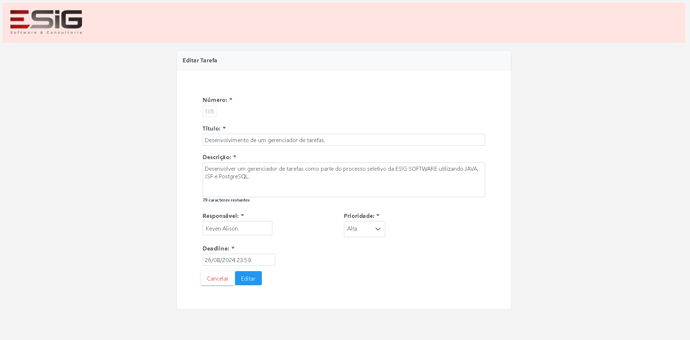

# DESAFIO ESIG SOFTWARE - GERENCIADOR DE TAREFAS

Esse projeto foi proposto pela ESIG com o objetivo de avaliar os conhecimentos de seus candidatos para a vaga de estágiário de Desenvolvimento Java. O desafio se resume em criar um gerenciador de tarefas capaz de realizar as funcionalidades básicas de um CRUD.

## PANORAMA GERAL DA APLICAÇÃO
A proposta original segue o seguinte modelo de desenvolvimento, de forma que existem duas principais telas para o cadastro e listagem de tarefas. Além disso, dentro da listagem existe um filtro para controlar o conteúdo visualizado.
<h1>
   
</h1>

  


## EXECUCAO DA TAREFA
A aplicação foi projetada com base no padrão de arquitetura MVC, visando facilitar o desenvolvimento através de uma clara separação entre as camadas de visualização, lógica de negócio e dados, aprimorando a comunicação entre elas e facilitando o escalonamento do projeto. A partir disso, a aplicação foi criada utilizando o MAVEN como gerenciador de dependências, sendo adicionadas as seguintes tecnologias:
* JAVA 8
* Hibernate 5.3.6.FINAL (JPA)
* PostgreSQL
* Java ServerFaces(JSF) 2.2.17
* PrimeFaces 12.0.0
* TOMCAT 9.0

Com essas ferramentas foi possível criar uma aplicação visualmente agrádável e intuitiva, com o devido tratamento de dados na camada de persistência e contando com tratamento de erros simples.

<h1></h1>
<h1></h1>
<h1></h1>
<h1></h1>


## Executando o projeto
* Em uma pasta inicialize um repositório e clone o projeto
```bash
$ git init
$ git clone git@github.com:KevenAlison/TaskManager.git
```
* Utilizando sua IDE de preferência (O projeto foi desenvolvido no ECLIPSE) importe o projeto clonado como um projeto MAVEN.
* Garanta que o Compilador da IDE esteja configurado para Java 1.8
* Atualize o arquivo persistence.xml para seu banco de dados
```bash
	    <property name="javax.persistence.jdbc.url" value="jdbc:postgresql://localhost:5432/seu-banco"/>
	    <property name="javax.persistence.jdbc.user" value="seu-user"/>
	    <property name="javax.persistence.jdbc.password" value="sua-senha"/>
	    <property name="javax.persistence.jdbc.driver" value="org.postgresql.Driver"/>
	    <property name="hibernate.dialect" value="org.hibernate.dialect.PostgreSQLDialect"/>
	    <property name="hibernate.hbm2ddl.auto" value="update"/>
	    <property name="hibernate.show_sql" value="true"/>      
```
* Start a aplicação utilizando APACHE TOMCAT 9.0


## Pendencias
* Os testes unitários não foram implementados por falta de expertise no assunto.
* Não foi possível lidar à tempo com os conflitos ao realizar do deploy da aplicação.

  
  

